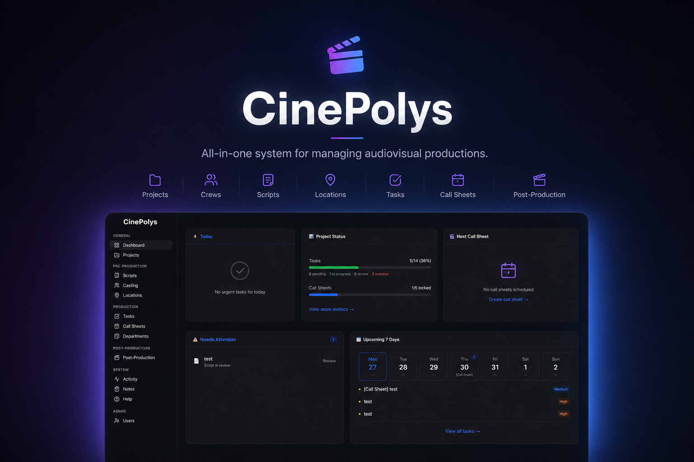

<p align="center">
  
  
  
  
  
  
  
</p>

<p align="center">
  <h1 align="center">CinePolys — Film Production Management</h1>
</p>

<p align="center">
  
</p>

<p align="center">
  All-in-one system for managing audiovisual productions.
</p> Organize projects, crews, scripts, locations, casting, tasks, call sheets, and post-production from a single dashboard.

---

## 📑 Table of Contents

- [✨ Features](#-features)
- [🎯 Goal](#-goal)
- [🚀 Quick Start](#-quick-start)
  - [Requirements](#requirements)
  - [Steps](#steps)
  - [Access](#access)
- [📚 Documentation](#-documentation)
  - [Tech Stack](#tech-stack)
  - [Project Structure](#project-structure)
  - [Roles](#roles)
  - [Modules](#modules)
- [🗺️ Roadmap](#️-roadmap)

---

## ✨ Features

| Module            | Description |
| ----------------- | ----------- |
| 🎬 **Projects**   | Project CRUD with drag & drop ordering |
| 📜 **Scripts**    | Versioning, scene breakdown and tracking |
| 🎭 **Casting**    | Cast database and profiles |
| 🗺️ **Locations**  | Interactive map powered by Leaflet |
| ✅ **Tasks**      | Board with filters, comments and due dates |
| 📋 **Call Sheets**| Production call sheets with shareable links |
| 👥 **Departments**| Team organization |
| 🎞️ **Post-production** | VFX tracking, cuts, ADR and deliverables |
| 📊 **Activity**   | Real-time change history (SSE) |

---

## 🎯 Goal

Centralize and simplify film production management — replacing scattered spreadsheets and fragmented communications with a unified platform featuring role-based access, real-time notifications, and workflow control from pre-production through final delivery.

---

## 🚀 Quick Start

### Requirements

- Node.js 20+
- npm

### Steps

```bash
# Clone the repository
git clone https://github.com/symonchannel-jpg/CinePolys.git
cd CinePolys

# Install dependencies
npm install

# Set up environment variables
cp .env.example .env

# Generate Prisma client and sync database
npx prisma generate --schema prisma/schema-sqlite.prisma
npx prisma db push --schema prisma/schema-sqlite.prisma

# Seed initial data (optional)
npx tsx prisma/seed.ts

# Start the development server
npm run dev -- --port 3001
```

> **Windows:** You can use `start.bat` to automate all steps.  
> **Mac / Linux:** The commands above work the same. Optionally create a `start.sh` script with the same logic.

### Access

Open [http://localhost:3001](http://localhost:3001). The app automatically redirects to the login page.

---

## 📚 Documentation

### Tech Stack

| Layer         | Technology                           |
| ------------- | ------------------------------------ |
| Frontend      | Next.js 16, React 19, Tailwind CSS 4 |
| UI            | Base UI, Lucide React                |
| Database      | SQLite (dev) / PostgreSQL (production) |
| ORM           | Prisma 7                             |
| Auth          | NextAuth v4                          |
| Maps          | Leaflet                              |
| Images        | Sharp                                |

### Project Structure

```
src/
├── app/
│   ├── (app)/          # Authenticated routes (Dashboard, Projects, Tasks, etc.)
│   ├── api/            # REST API routes
│   ├── login/          # Login page
│   ├── register/       # Registration page
│   └── share/          # Shared links
├── components/
│   ├── layout/         # AppLayout, Sidebar, Omnibar, etc.
│   ├── modules/        # Feature components (location map, etc.)
│   └── ui/             # Base components (Button, Dialog, Input, Select, etc.)
├── lib/                # Shared logic (auth, prisma, utils, contexts)
└── types/              # TypeScript type definitions
```

### Roles

- **ADMIN** — Full access, user and project management
- **HOD** — Head of Department, manages their team and tasks
- **CREW** — Team member, views and updates assigned tasks

### Modules

- **Dashboard** — Per-project overview with key metrics
- **Projects** — Project CRUD with drag & drop ordering
- **Scripts** — Versioning, scene breakdown and tracking
- **Casting** — Cast database and profiles
- **Locations** — Interactive map powered by Leaflet
- **Tasks** — Board with filters, comments and due dates
- **Call Sheets** — Production call sheets with shareable links
- **Departments** — Team organization
- **Post-production** — VFX tracking, cuts, ADR and deliverables
- **Activity** — Real-time change history (SSE)

---

## 🗺️ Roadmap

### Security
- [ ] Role-based authorization middleware for API routes
- [ ] Input validation with Zod on all endpoints
- [ ] Project-scoped notifications (avoid spamming all users)
- [ ] Validate callbackUrl on login (open redirect)
- [x] Prisma transactions for multi-model operations
- [ ] Rate limiting on critical API routes

### Design System
- [x] Corporate color palette with OKLCH tokens (primary, success, warning, info, danger, neutral)
- [x] Semantic CSS variables replacing hardcoded Tailwind colors (`bg-success`, `text-warning`, etc.)
- [x] Centralized status/priority/complexity colors in `constants.ts`
- [x] Unified progress bars (single `--primary` color instead of rainbow)
- [x] Geist Sans properly applied as body font
- [x] Custom type scale for consistent typography
- [x] Professional ColorPicker presets

### UX / Interface
- [x] Server-side pagination (offset-based, 20 items/page)
- [x] Toast system replacing native `alert()`
- [x] Deep links in search results (`/casting?focus=id`)
- [x] Server-side text search with debounce
- [x] Filtered vs total counts in list headers
- [x] Accessibility: ARIA roles on tabs, keyboard nav on lists
- [x] Accessible `<Link>` elements replacing bare `div onClick`
- [x] Confirmation dialog on filter clear
- [x] Reusable `<ColorPicker>` component
- [x] Fixed sidebar terminology (Clapperboard → Film, Llamados → Call Sheets, removed misleading notification badge)
- [x] Fixed dashboard accordion nesting

### Redundancies / Code Quality
- [x] Shared constants (statusColors, priorityLabels)
- [x] Accessible `<FormTabs>` component with ARIA
- [ ] Eliminate `any` types — strict typing across the app
- [x] Migrate `Location.images` and `CallSheet.content` to native Json type
- [x] Remove manual JSON.parse/stringify for Prisma Json fields

### Performance
- [x] Parallelize dashboard queries with `Promise.all`
- [x] Composite indexes (`projectId + archivedAt + status`)
- [x] Batch notifications (avoid sequential loop)
- [ ] Redis-based SSE bus (multi-instance support) — *low priority for single-server*

### Architecture
- [ ] Global error boundaries per route (`error.tsx`)
- [ ] Schema validation with Zod on all endpoints
- [ ] `Project.status` as enum instead of free String
- [ ] Unify SQLite / PostgreSQL schemas
